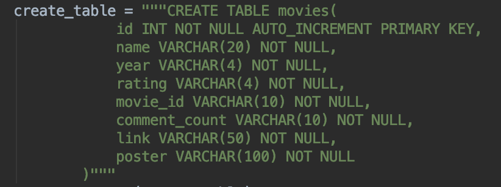
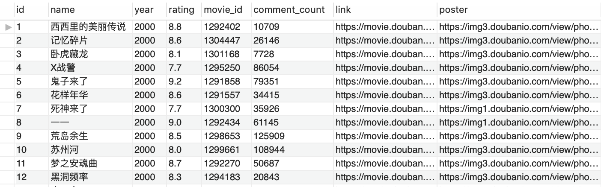

#### douban_movies_spider 爬虫报告
##### 1. 任务说明
- 爬取豆瓣网(http://movie.douban.com)的电影数据，包括**电影ID(movie_id)、电影名称(name)、上映年份(year)、用户评分(rating)、评论人数(comment_count)、主页链接(link)、海报地址(poster)**，因数据量太大只爬取**2000年~2019年共 42701 部**。
- GitHub地址：https://github.com/wangyixu/douban_movies_spider
- MySQL数据库接口信息如下：
	| IP | 端口号 | 用户名 | 密码 | 数据库名 | 数据表名 |
	| :------: | :------: | :------: | 
	| 114.116.43.151 | 3306 | visitor | password | douban | movies | 
- 百度云：https://pan.baidu.com/s/1SyPjW2_ivM8_83ccHRua-g ；密码：ci9y。

##### 2. 实践流程
- **2.1 获取代理IP**：从 **http://www.proxyserverlist24.top/ 和 http://www.live-socks.net/**两个网站获取并检测，得到合格可用的代理IP地址；
- **2.2 按年份进行数据爬取**：每次访问**url = "https://movie.douban.com/tag/" + str(year) + "?start=" + str(i*20)**，其中year表示年份，start表示起始数据页面；
- **2.3 将数据导入数据库**：
	
	
